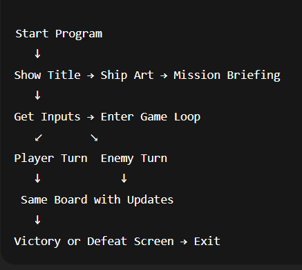
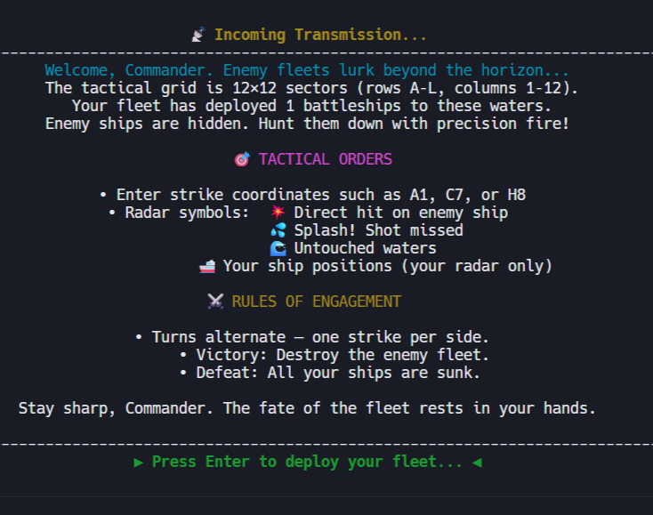
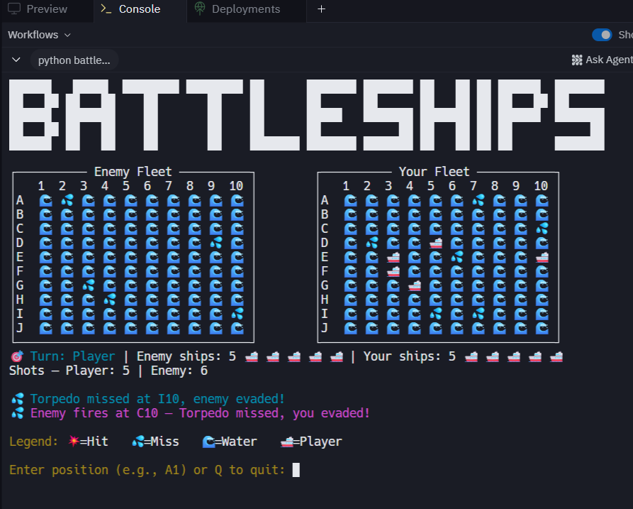

<pre align="center">

██████   █████  ████████ ████████ ██      ███████ ███████ ██   ██ ██ ██████  ███████ 
██   ██ ██   ██    ██       ██    ██      ██      ██      ██   ██ ██ ██   ██ ██      
██████  ███████    ██       ██    ██      █████   ███████ ███████ ██ ██████  ███████ 
██   ██ ██   ██    ██       ██    ██      ██           ██ ██   ██ ██ ██           ██ 
██████  ██   ██    ██       ██    ███████ ███████ ███████ ██   ██ ██ ██      ███████ 
                                                                                     
                                                                                      


*Battleships Game – Python Terminal Edition*  

    ⣠⠀⠀⠀⠀⠀⠀⠀⠀⠀⠀⠀⠀⠀⠀⠀⠀⠀⠀⠀⠀⠀⠀⠀⠀⠀⠀⠀⠀⠀⠀⠀⠀⠀⠀⠀⠀⠀⠀⠀⠀⠀⠀⠀⠀⠀⠀⠀⠀⠀⠀⠀⠀⠀⠀⠀⠀⠀⠀
⠀⠀⠰⠶⢿⡶⠦⠄⠀⠀⠀⠀⠀⠀⠀⠀⠀⠀⠀⠀⠀⠀⠀⠀⠀⠀⠀⠀⠀⠀⠀⠀⠀⠀⠀⠀⠀⠀⠀⠀⠀⠀⠀⠀⠀⠀⠀⠀⠀⠀⠀⠀⠀⠀⠀⠀⠀⠀⠀⠀⠀⠀⠀
⠀⢀⣀⣿⣿⣿⣿⣿⣿⡇⢀⠀⢀⡀⠀⣀⣀⣠⣀⣀⡀⠀⠀⠀⠀⠀⠀⠀⠀⠀⠀⠀⠀⠀⠀⠀⠀⠀⠀⠀⠀⠀⠀⠀⠀⠀⠀⠀⠀⠀⠀⠀⠀⠀⠀⠀⠀⠀⠀⠀⠀⠀⠀
⠉⠻⠿⣿⣿⣿⣿⣿⣶⣿⣿⣿⣿⣿⣿⣿⣿⣿⣿⣿⣽⣿⣿⣿⣿⣿⣿⣿⣿⣿⣿⣿⣿⣶⣶⣿⣿⣶⣶⣾⣧⣤⣴⣆⣀⢀⣤⡄⠀⠀⣀⡀⠀

</pre>

---

## Battleships Game – Python Terminal Edition

This is a **Python-based Battleships game** built for the terminal.  
The player battles against the computer with alternating turns until one fleet is destroyed.  

This project was developed as part of the **Python Essentials Portfolio Project** (Full Stack Software Development Diploma).  
It demonstrates core Python skills: loops, functions, lists, input validation, error handling, and use of external libraries.


---

## 🎯 Project Purpose

- **User Goal**: Play a fun, logic-based Battleships game with interactive feedback.  
- **Developer Goal**: Implement a Python project showing clear logic, error handling, and visual engagement in the terminal.  

---

## 🌊 Project Overview

**Battleship Command** is a Python-based command-line game where you challenge a hidden computer fleet on a dynamic grid.  
With a rainbow ASCII title screen, mission briefings, and emoji-rich board visuals, this experience is as educational as it is entertaining.

---

## ✨ Features 

- **Cinematic Intro**:  
  - Rainbow gradient ASCII title — **BATTLESHIPS**  
  - Centered green ASCII ship art  
  - Mission briefing with tactical orders & rules

- **Custom Gameplay**:  
  - Choose grid size (8–15) & ship count (1–5)  
  - Validations for all inputs (defaults applied if blank)  

- **Classic Battleship Logic**:  
  - Side-by-side framed boards: "Enemy Fleet" vs. "Your Fleet"  
  - Emojis:  
    - 🌊 water  
    - 💦 miss  
    - 💥 hit  
    - 🚢 ship  
  - Alternating turns: player fires, then computer fires

- **Status Panel**:  
  - Legend, ship counts, shots taken, and last-turn results

- **Endgame Messages**:  
  - **Victory**: 🏆 all enemy ships sunk  
  - **Defeat**: 💀 all your ships lost  

- **Robustness**:  
  - Friendly quit option (`Q`)  
  - Handles invalid and repeated inputs gracefully  

---


##Game Flow Diagram
  
  
------------------------------
  
## 📖 How to Play

1. Clone the repository:  
   ```bash
   git clone https://github.com/boneyphilip/battleship-game.git
   cd battleship-game

2. Install dependencies:

   pip install -r requirements.txt


3. Run the game:

   python3 battleship.py
--------------------------------------------------------------------------

## Deployment

## Deployment

This project was deployed using [Replit](https://replit.com).

⚠️ Note: As this is a **command-line game**, it does not run as a standalone website.  
Instead, it runs in the Replit online IDE console.  

### How to Play on Replit
1. Open the project link: [Battleship Game on Replit](https://replit.com/@boneyphilip/battleship-game?v=1)  
2. Click the **Code** tab (if you see the README preview).  
3. Press the green **Run** button at the top of the page.  
4. The game will launch in the console on the right-hand side.  

--------------------------------------------------------------------------
   📸 Screenshots

👉 (Replace these placeholders with actual images from your game output)

- Welcome Screen
  
   

- Mission Briefing

  

- Game Board Example

  

------------------------------------------------------------------------

  🧪 Testing & Validation

| Scenario            | Input            | Expected Behavior         | Result |
| ------------------- | ---------------- | ------------------------- | ------ |
| Empty grid size     | ↵                | Defaults to 8             | Pass   |
| Invalid grid size   | 20               | Error: must be 8–15       | Pass   |
| Empty ship count    | ↵                | Defaults to 3             | Pass   |
| Invalid ship count  | 6                | Error: must be 1–5        | Pass   |
| Invalid shot format | `Z9`             | Error: valid A–X + number | Pass   |
| Repeated shot       | Same coord twice | Warning: already tried    | Pass   |
| Immediate quit      | `Q`              | Ends game politely        | Pass   |
| Full game won       | Sink all enemy   | Victory screen shown      | Pass   |
| Full game lost      | All ships sunk   | Defeat screen shown       | Pass   |


- Style:

  - Code checked with PEP8/Flake8, no major warnings.

- UX tested on:

   - VS Code terminal

   - Windows PowerShell

   - Replit console

   - PythonAnywhere

-------------------------------------------------------------------

🗂️ Technologies Used

   - Python 3 — core language

   - Colorama — colored terminal text

   - Wcwidth — ensures emojis align in grid

   - Git & GitHub — version control

--------------------------------------------------------------------

🚀 Deployment

Run locally

   - Clone repo

   - Install dependencies (pip install -r requirements.txt)

   - Run with python3 battleship.py

Run online

   - Linked with Replit for instant play in browser.

   - Deployed on PythonAnywhere for cloud execution.

----------------------------------------------------------------------

👨‍💻 Credits

  - Colorama → terminal text coloring.

  - Wcwidth → emoji width alignment.

  - ASCII Battleship art sourced from community ASCII art templates.

  - Game logic designed independently by Boney Philip.

----------------------------------------------------------------------

📜 Plagiarism Statement

   This project is an original work developed for the Diploma in Full Stack Software Development.
   All external resources (Colorama, Wcwidth) are credited.
  
